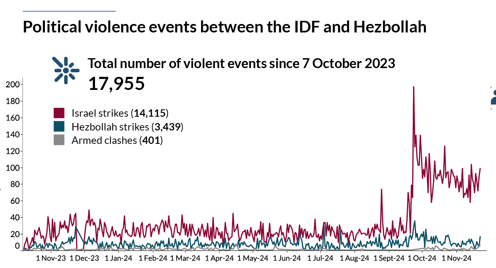

# Propaganda Tactics
The anti-Israeli campaign is driven by both “authentic” Jew/Israeli-haters and a coordinated propaganda machine, often backed by Iran, Russia, or both.
After seeing many posts, you begin to recognize certain patterns that are worth highlighting.
It’s important to note that these patterns evolve over time, and this list is by no means exhaustive—but it should help you identify some of the common tactics when you encounter them.

## List of tactics and Propaganda tools
### Counter-blaming
Or in other words – blaming Israel for what they themselves do.

This is probably the most well-known tactic: the anti-Israeli crowd will accuse Israel of the very things that Israel accuses Hamas of. The goal is to create a false equivalence between Hamas—a murderous terror organization—and Israel, a democratic country, and to diminish the shock of Hamas’s actions, especially those committed on October 7th. For example:

* Comparing Israeli hostages to Palestinian prisoners (who usually committed violent crimes)
* Accusing Israeli soldiers of raping Palestinian women
* Accusing Israeli soldiers of targeting civilians
* Accusing Israelis of dehumanizing Palestinians and teaching their children to hate
* And so on

My approach is to provide real examples of how the other side engages in exactly these behaviors (which are easy to find—I will add resources for easier access) and to show that these accusations are, in fact, projections of what Hamas and the PA actually do.

### Trash-Talking
Another prevalent tactic is the deliberate and repeated dissemination of false accusations, operating on the principle that if a lie is told often enough, people will eventually accept it as truth. When this strategy is employed, you'll observe posts that completely disregard your arguments. Instead, they'll launch into a litany of emotionally charged accusations, such as calling you a "genocider, baby-killer, ethno-cleansing, European white colonizer, apartheid terror state," among other inflammatory terms. The core objective behind this constant repetition is to sway the opinions of other readers.

My tactic is to call them out exactly - saying that they can repeat these lies, but it will not make them real, and then to address at least some of these accusations show how false they are
We will address some of these accusations in specific pages

### From specific to generic
This tactic involves presenting a claim supported by examples, but crucially, these examples are anecdotal or non-representative of the norm, sometimes even undermining the original claim upon closer inspection. It exploits the fact that most readers lack the in-depth knowledge to differentiate between actual reality and isolated incidents.

Consider these common examples:

A video of a Jewish mother asking her child what he wants to be when he grows up, and he replies, "I want to kill Arabs."

Referencing the case of Elor Azaria, who killed a Palestinian (terrorist) after he was already incapacitated on the ground.

Mentioning the Deir Yassin massacre.

These examples are frequently used to portray Israelis as villains, yet they are either isolated incidents or, upon examination, demonstrate the opposite:

The first video is an anecdote, not indicative of widespread sentiment.

Elor Azaria was prosecuted and imprisoned for his actions, which directly refutes the idea that such behavior is condoned or supported.

Deir Yassin is a complex historical event that warrants detailed discussion. However, the fact that this eighty-year-old incident is almost exclusively cited suggests a scarcity of other supporting evidence for broader accusations.

### Multi-layered claims
This is one of my favorites! I am pretty sure there is another, more professional, name for these things, but since I am not a professional, I will use my made-up name for it 🎃
Multi layered claims are of the following structure - “Given the implicit _false claim A_ I claim that _false claim b_”
Using this structure the author is trying to make you try to debunk claim B, and by that admitting that claim A is true when it isn’t, or at least getting you to “play in their court” which will usually take you to places where you will have a harder time.
Now these claims will not always be obvious, and that’s what makes them trickier.
A quick example - someone will show you a graph of the number (source - ACLED: [Situation update: Israel-Hezbollah conflict](https://acleddata.com/2024/10/10/situation-update-israel-hezbollah-conflict/)):

 Combines the fact that Israel is invading Lebanon and that the IDF is provoking more violence, will make people that the IDF is the aggressor while Hezbollah is not. also notice that this is true from “day 1” of the conflict.
 I will not get into the question of how accurate this data is and how biased the authors are, because ACLED are considered quite credible
 
 By showing this graph you will be dragged to talk about the numbers, while implicitly you are admitting that Hezbollah and the IDF are equivalent, while Hezbollah have been firing rockets at the entire northern Israel, while Israel is targeting Hezbollah centers and is trying to prevent them from firing into Israel. 

 This is just a single example of how you might be dragged into uncomfortable territories, sometimes without even noticing that you’ve been tricked

### Multi-layered Claims (or The Loaded Question Fallacy)

This tactic, which I refer to as "multi-layered claims," is a particularly insidious form of argumentation, often akin to what is more formally known as a loaded question or complex question fallacy. Its structure typically follows this pattern: "Given the implicit false premise A, I assert that false claim B."

The design of this structure aims to maneuver the audience into attempting to refute "claim B." In doing so, they inadvertently concede the validity of "premise A," even if it is fundamentally untrue. This effectively forces you to "play on the opponent's terms," often leading the discussion to grounds where your position is inherently disadvantaged. The true subtlety of these claims lies in their often non-obvious nature, making them particularly tricky to identify.

Consider the following example, based on a graph depicting political violence events between the IDF and Hezbollah (source: ACLED, "Situation update: Israel-Hezbollah conflict"):
[Situation update: Israel-Hezbollah conflict](https://acleddata.com/2024/10/10/situation-update-israel-hezbollah-conflict/)):

By combining the implicit (and often false) premise that Israel is invading Lebanon with the visual representation suggesting the IDF provokes more violence, this graph can lead readers to believe that the IDF is solely the aggressor, while Hezbollah is not. Notice how this perceived aggression appears consistent from "day one" of the conflict according to the visual.

While I won't delve into the accuracy or potential bias of ACLED's data here, as they are generally considered a credible source, the deceptive nature of this presentation lies elsewhere. By presenting this graph, the discussion is immediately drawn towards the raw numbers. Implicitly, however, you are pressured to accept an equivalence between Hezbollah and the IDF. This is problematic, as Hezbollah has been indiscriminately firing rockets at northern Israel, whereas Israel's actions primarily target Hezbollah centers in an effort to prevent these attacks.

This serves as just one example of how such multi-layered claims can subtly drag you into uncomfortable or disadvantageous argumentative territories, sometimes without you even realizing you've been manipulated.

### Pro-Palestine
Here's a critical, though perhaps controversial, observation: The "Pro-Palestine" label is often used to frame any opposition as being "Against Palestine." This immediately puts you at a disadvantage, as being "for" something is inherently seen more positively than being "against" it. Even if you support a Palestinian state (as I do, despite concerns about current leadership), challenging "Pro-Palestinian" narratives means starting from a weaker position.

Crucially, many individuals using this label are not truly "Pro-Palestinian" in a humanitarian sense. Their true allegiance is frequently "Pro-Hamas," "Anti-Israel," or "Pro-Terror." Therefore, it's essential to reject their preferred branding and instead, accurately identify their stances for what they truly represent.

