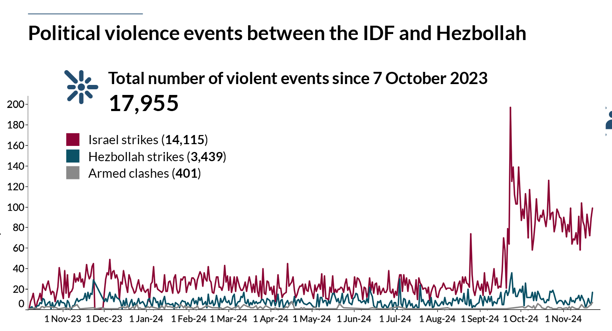

# Propaganda Tactics

The Anti-Israeli campaign combines “authentic” Jew/Israeli-haters and a propaganda machine backed by either Iran, Russia or both
As such, after seeing many posts, you recognize different patterns which I think are worth mentioning. 
it is important to say that these patterns evolve over time, and by no means this list is a full list of their tactics, but the list below will list at least a few that will allow you to recognize patterns when you see them

## List of tactics and Propaganda tools
### Counter-blaming
Or in other wods - Blame Israel for what we do
Probably the most well-known tactic being used - the anti-Israeli crowd will blame Israel for anything that Israel blames Hamas. this tries to create equivalence between Hamas, a murderous terror organization, and Israel - the democratic country, and to reduce the shock from the things that Hamas does, mainly those that happened during October 7th.  For example:
* Comparing the hostages to the Palestinian prisoners (that usually committed violent crimes)
* Accusing Israeli soldiers of rape of Palestinian women
* Accusing Israeli soldiers of targeting civilians
* Accusing Israelis ofdehumanizing Palestinians and teaching their kids to hate Palestinians
* etc.

My tactic here is to give a real example of how the other side does exactly that (easy to find these examples, I will add some resources for easier access) and show how these things are exactly the things that Hamas and the PA do

### Trash-Talking
Or in other words - Throw a lot of false accusations for the sake of saying them
This is another well-known tactic, also known as - if you repeat the same lie over and over again, people will start believing it
When this tactic is used, you will see posts that, in response to anything you say, will not address anything you say but instead will just say that your country is a genocider baby-killer ethno-cleansing, European white colonizer, apartheid terror state (or something along these lines)
The main goal of these things is to influence other readers to believe it, so they keep repeating these over and over

My tactic is to call them out exactly - saying that they can repeat these lies, but it will not make them real, and then to address at least some of these accusations show how false they are
We will address some of these accusations in specific pages

### From specific to generic
Or in other words - take one example, make it a general rule
This tactic is about making a claim and then giving examples that support this claim (which is valid of course), but taking examples that do not represnt the norm, and sometimes even prove that the other point when you get into the details

This is a classic tactic that leans on the fact that most readers do not have enough knowledge to distinguish between reality and anecdotes 

For example - 
* A video of a Jewish mother asking her child what he would like to be when he grows up, and he says he would like to kill the Arabs
* Bringing up Eleor Azarya's story of killing a Palestinian (terrorist) after he was already on the floor
* Bringing up the Dier-Yasin massacre

These all serve to portray Israelis is villians while they are either anecdotal or prove otherwise:

- The first video is an anecdote
- Eleor Azarya was sent to prison for what he did, which proves exactly the opposite point - we do not support it here
- Dier Yassin is a more complex issue and deserves its own page, but the mere fact that this is the only example that is constantly being brought up from 80 years ago shows they do not have a lot of evidence

### Multi-layered claims
This is one of my favorites! I am pretty sure there is another, more professional, name for these things, but since I am not a professional, I will use my made-up name for it 🎃
Multi layered claims are of the following structure - “Given the implicit _false claim A_ I claim that _false claim b_”
Using this structure the author is trying to make you try to debunk claim B, and by that admitting that claim A is true when it isn’t, or at least getting you to “play in their court” which will usually take you to places where you will have a harder time.
Now these claims will not always be obvious, and that’s what makes them trickier.
A quick example - someone will show you a graph of the number (source - ACLED: [Situation update: Israel-Hezbollah conflict](https://acleddata.com/2024/10/10/situation-update-israel-hezbollah-conflict/)):

 Combines the fact that Israel is invading Lebanon and that the IDF is provoking more violence, will make people that the IDF is the aggressor while Hezbollah is not. also notice that this is true from “day 1” of the conflict.
 I will not get into the question of how accurate this data is and how biased the authors are, because ACLED are considered quite credible
 
 By showing this graph you will be dragged to talk about the numbers, while implicitly you are admitting that Hezbollah and the IDF are equivalent, while Hezbollah have been firing rockets at the entire northern Israel, while Israel is targeting Hezbollah centers and is trying to prevent them from firing into Israel. 

 This is just a single example of how you might be dragged into uncomfortable territories, sometimes without even noticing that you’ve been tricked

### Pro-Palestine
This may be a bit controversial, but I will state it nevertheless.
Using the “Pro-Palestine” tag makes you, the one opposing it to be Against Palestine. Now, while I know some people are actually against the entire idea of a Palestinian state, I am for the idea (not with the current leadership of course), and in any way this puts you in a negative light and in an inferior position because it is always better to be for something rather than against something. and so - if you post things and accuse people that are “Pro Palestinians” you will immediately start from a worse position. 

Since these people are not really “Pro-Palestinians” in the humane sense of it, but rather “Pro Hamas”, “Anti-Israelis” or “Pro Terror”, it is better to call these people for what they really are and not to fall into their positioning of themselves

