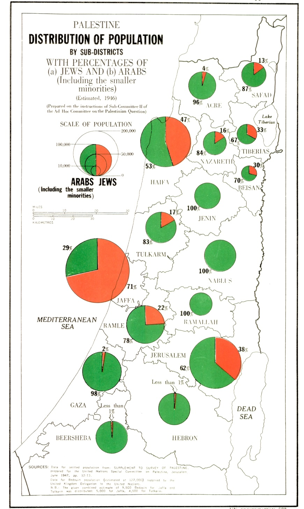

# Who Owns The Land

## Intro
An important topic in this conflct is "Who owns the land". Both the Jews and the Arabs believe that the land belongs to them, that is the core of the conflict. The arabs claim that  

1. They are Indigineous to the land, while Israelis are colonizers (more on this topic in the [“The Indigineous People” page](The indigineous People.md) 
2. They were promised the land by the British Government  
3. They were the majority of the population and therefore the partition plan was unfair, which explains why they rejected it
4. Jews stole their land

Claim number (3) also helps the Palestinian Narrative as an excuse for rejecting the partition plan and starting a war directly  after that

Claim number (1) is handled in its own page, we will try to discuss claims (2) + (3)

Claim number (4) will be handled under the page [Jews stole the land](Jews stole the land.md)

!!! warning "Disclaimer"
    While we would like to think that everything is straightforward, this topic is very sensitive and within it not everything is black and white. I will try to handle some of the sensitivities here, but will surely not be able to cover everything

## The state of the population of Israel during the Mandatory Palestine (British Mandate)
One of the most important points of the Palestinian argument, which is complex, is the state of the population during the british mandate, and also the duality of the British leadership at the time

In 1917 the British Government issues the [Balfour Declaration](https://en.wikipedia.org/wiki/Balfour_Declaration#/media/File:Balfour_declaration_unmarked.jpg) which supported the creation of a Jewish homeland within the land of Israel (Palestine). Around the same time, To get the support of the Arabs in their war against the Ottoman Empire, the Britians [promised](https://en.wikipedia.org/wiki/McMahon%E2%80%93Hussein_correspondence#:~:text=The%20McMahon%E2%80%93Hussein%20correspondence%20is,Revolt%20against%20the%20Ottoman%20Empire.) most of the lands hitherto ruled by the Ottoman Turks, presumably including Palestine

Additionally it needs to be noted that the Jewish population was much smaller, in numbers, than the Arab population, around 13% in 1914, and up to 30% in 1947 (see statistics [here](https://www.jewishvirtuallibrary.org/jewish-and-non-jewish-population-of-israel-palestine-1517-present), taken from an Israeli source because these values in Wikipedia are subjected to changes by Anti-Israelis). 

This led the Arabs to believe that the entire land should be theirs, and they perceived the growing Jewish immigration as a threat, which also led to the Arab Revolt in 1936
See below - the distribution of population as recorded by the Special Committee of the UN, you will see that most areas had an Arab majority

[1946 Arab/Jewish population by subdistricts (source: UN)](https://www.un.org/unispal/document/1946-map-of-palestine-indicating-distribution-of-population-by-subdistricts-with-percentages-of-a-jews-and-b-arabs/)

In the eyes of the Arab leaders, since the percentage of Jews was small, the fact that the Jewish state was around half of the entire land was unfair, therefore that is the reason they justify the fact that the Arabs refused the UN partition plan

Here are a few things that are worth mentioning:

* The British Mandate included also the east bank, what is Jordan today. The entire area of the land of Israel (including the west bank) is around 30km², the area of Jordan is around 90km² so giving the Arabs all of Jordan and half of Israel means they got 88% of the land
* When the UN did the partition plan, they already had to take into consideration the huge amount of refugee Jews after world-war II. It obvously makes sense, that if you decide to build a Jewish state, Jews around the world, certainly refugees would go there, and so there was no sense looking only at the current population
* The story of the population does not start in the 1920’s, more on that below

## The Jews got the better part
Another claim is that the Partition plan was unfair because the Jews got the better and more fruitfall parts (e.g. the coastline), while the Arabs got the rest  
Here is the map of the partition plan:
")  
[1947 UN Partition Plan (Source: Israeli National Library)](https://web.nli.org.il/sites/nli/english/digitallibrary/pages/viewer.aspx?presentorid=EDU_XML_ENG&docid=EDU_XML_ENG002651448)  

But actually this claim does two things:

1. It ignores the fact that the majority of the land (at the bottom) is actually the Negev - a desrt place which is not very suited for living (even nowdays it is pretty sparse and although it represents around 25% Area of Israel, only 10% of the population lives there, mostly in the northern part of it)
2. It uses modern-day judgment on things that were not true at the time. In the early days the area of the of the coastline was an area of Malaria which the Jews had to fight. below is the map of danger of Malaria. you will see that there is a striking correlation between areas with high danger of malaria and the area that was designated to Jews:  

")  
[1925 Map of Malaria (source - blog post)](https://elderofziyon.blogspot.com/2020/02/eradicating-malaria-from-palestine-was.html)

## The state of the population during the Ottoman empire

Another important point is that when looking at the population you need to look further back. how much? it’s hard to say

The question of the population is covered under [“The Indigineous People” page](The indigineous People.md) 

As for the land itself, while it looks like the Arabs had the most of the land, but this is [inaccurate](https://israeled.org/wp-content/uploads/2013/02/themes-land-issue-2-22-13.pdf). most of the land was either state-owned by the Ottoman empire or was owned by Arabs from outside of Israel.  
Therefore the claim that the British Government did not have the rights to give the land is wrong, as it inherited the rights of the Ottoman empire

## Conclusion
As you can see, there is no basis for the claim that the Arabs “owned” this land before, and therefore this claim is not valid 
